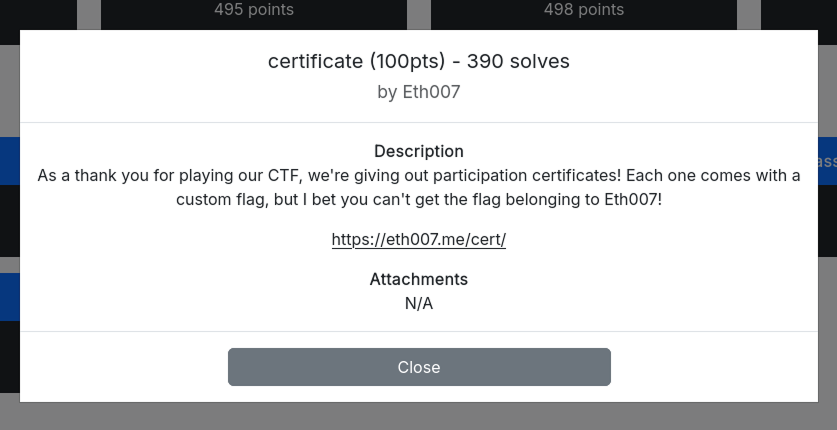
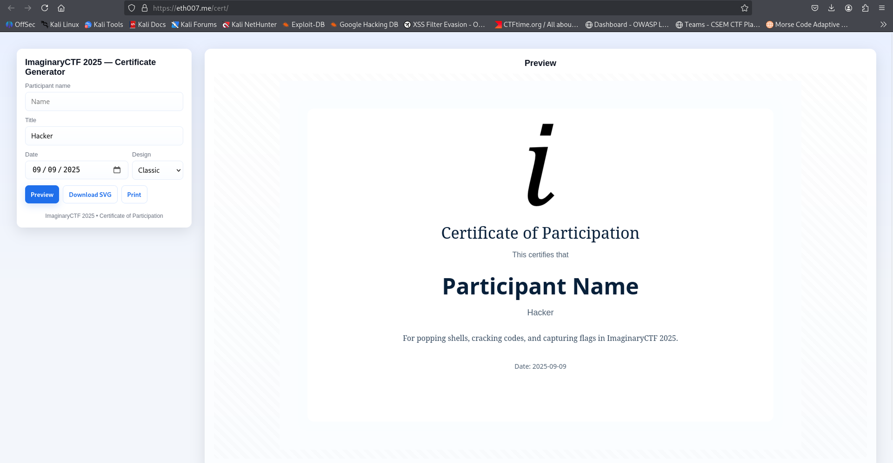
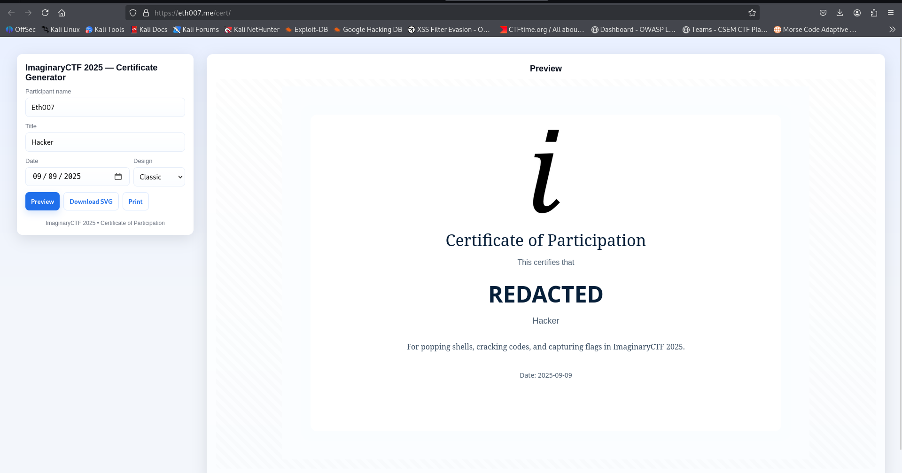
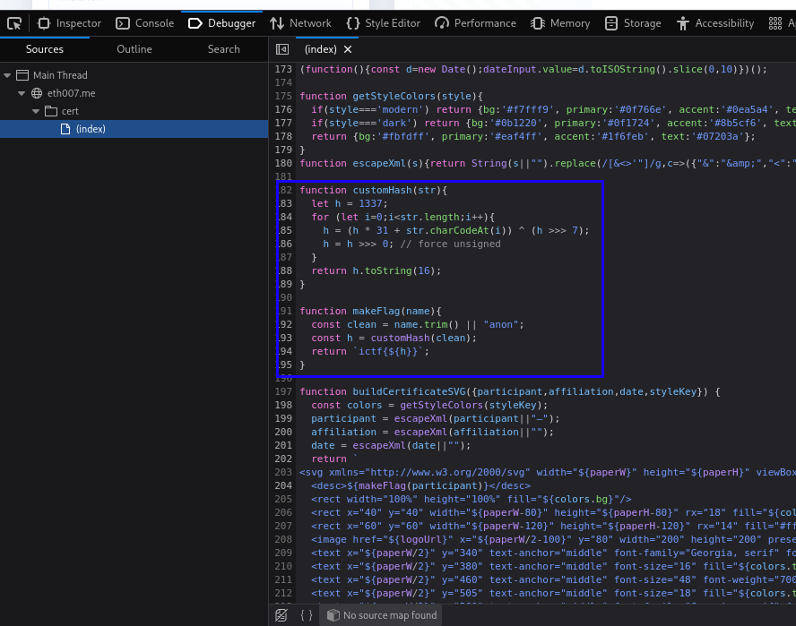
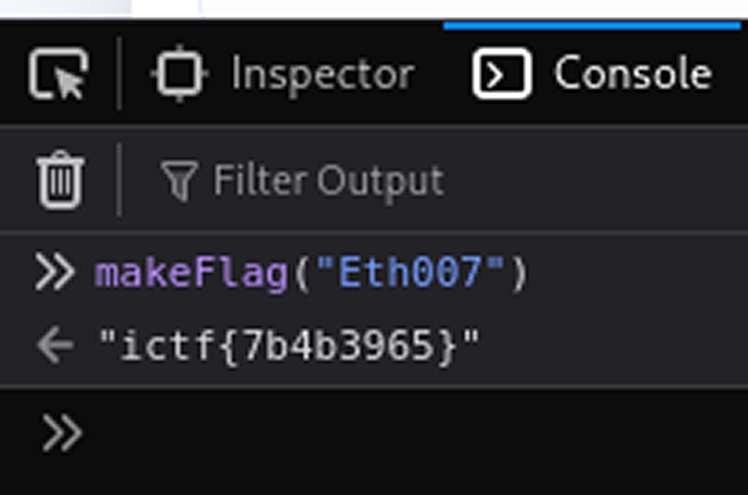

# WhiteDukesDZ - Imaginary CTF 2025 Writeup: certificate



---

## Challenge Summary

This challenge presents a web application that gives users certificates of participation in the Imaginary CTF 2025.

## Application Analysis

After visiting challenge main page:



We notice that there form where the user can submit its name, title, date of participation and the choosen design to generate its certificate. And since the challenge description says `we're giving out participation certificates! Each one comes with a custom flag, but I bet you can't get the flag belonging to Eth007!`, when trying to directly put the name to `Eth007` we get this output:



So we can't obtain the flag directly like this.


### Security Observations

After analyzing the web page source code from the browser Devtools, we notice this part:



This means that the flag generation is performed client-side. So we can generate the real flag just by manipulating the JS.

---

## Solution

According to the challenge description, to get the flag, we need to:

  - Get the flag of `name=Eth007`.

And since we already have the flag generation logic:

```js
function customHash(str){
  let h = 1337;
  for (let i=0;i<str.length;i++){
    h = (h * 31 + str.charCodeAt(i)) ^ (h >>> 7);
    h = h >>> 0; // force unsigned
  }
  return h.toString(16);
}

function makeFlag(name){
  const clean = name.trim() || "anon";
  const h = customHash(clean);
  return `ictf{${h}}`;
}
```

We can simply call `makeFlag("Eth007")` in the browser Devtools console and get the flag:


