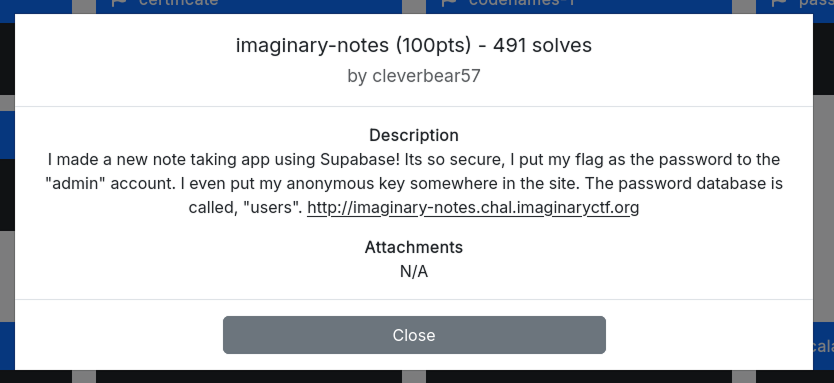
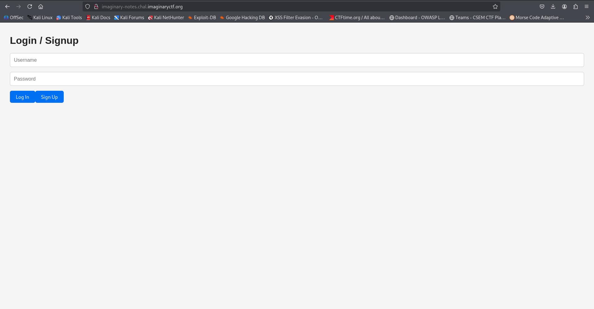
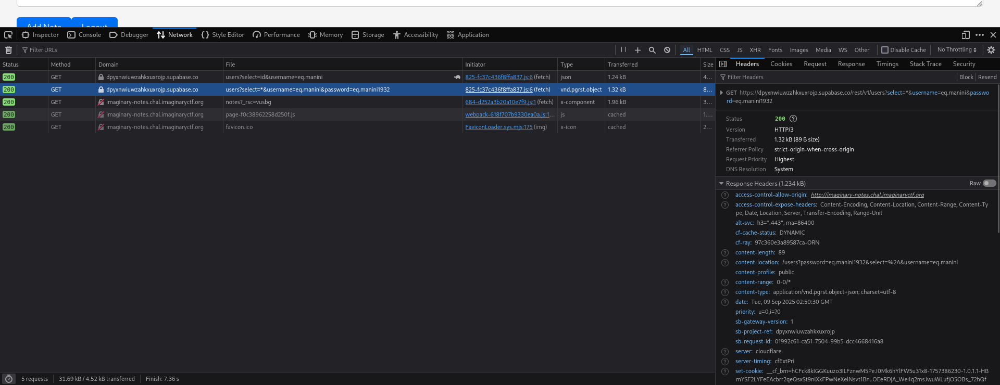
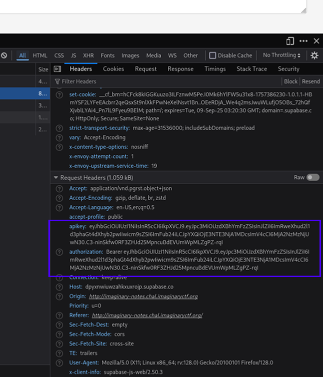

# WhiteDukesDZ - Imaginary CTF 2025 Writeup: imaginary-notes



---

## Challenge Summary

This challenge presents a web application built with Next.js, utilizing Supabase for authentication, and note storage. Users can log in and manage their personal notes through a full-stack interface.

## Application Analysis

After visiting challenge main page:



We notice a login / registration page. when that accessing the browser DevTools (`CTRL + ALT + I`) and going to the Network tab and then submitting the regitration form:



We notice that a request to Supabase API is made directly from the client-side (our browser).


### Security Observations

And after carefully analyzing the request we can notice that there is a hardcoded Authorization token + API key:



As it is mentioned in the description of the challenge `I even put my anonymous key somewhere in the site.`, we found it.
These tokens can be used to retrieve whatever we want from the Supabase database.

---

## Solution

According to the challenge description, to get the flag, we need to:

  - Get the password of `username=admin` account (`I put my flag as the password to the "admin" account`).

We can do this using the tokens we found above. We automated this using the `solution/solution.py` python script.

If successful, the flag will be returned:

```data
└─$ python3 solution.py
ictf{why_d1d_1_g1v3_u_my_@p1_k3y???}
```
