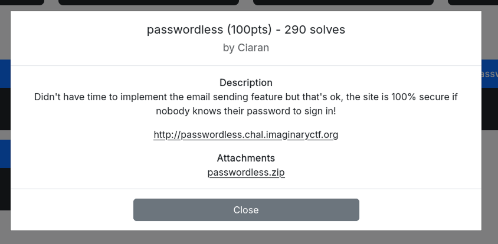
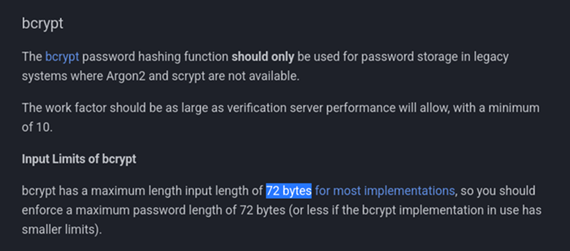

# WhiteDukesDZ - Imaginary CTF 2025 Writeup: passwordless



The full source code for the application was provided (see the `challenge` directory), allowing for in-depth analysis and understanding of its functionality and security.

---

## Challenge Summary

This challenge presents a Node.js web application built with Express and SQLite. The app implements passwordless registration: users sign up with their email, and a temporary password is generated but not emailed to them. Authentication uses bcrypt-hashed passwords, and user sessions are managed with express-session. The application enforces rate limiting, normalizes email addresses, and stores user data in an in-memory SQLite database.

## Application Analysis

The core of the challenge is implemented in `index.js` using Node.js, Express, and an in-memory SQLite database. Here is a detailed breakdown of its logic and security implications:

- **User Registration:**
  - Users register by submitting their email address. The app normalizes the email and checks its length (max 64 chars).
  - A temporary password is generated by concatenating the email with random bytes, then hashed with bcrypt and stored in the database.
  - The app is supposed to send this password via email, but the email delivery is not implemented (`TODO` comment).
  - If the email is already registered, the user is redirected with an error message.

- **Authentication:**
  - Users log in by submitting their email and password. The app normalizes the email and checks the password against the bcrypt hash in the database.
  - On successful login, the session is regenerated and the user object is stored in the session.
  - Failed logins redirect to the login page with an error message.

- **Session Management:**
  - Sessions are managed with `express-session` and a randomly generated secret.
  - The session stores the user object after login, and is used to restrict access to the dashboard.
  - Logging out destroys the session.

- **Rate Limiting:**
  - All POST requests to `/session` and `/user` are rate-limited to 10 requests per minute per IP.

- **Routes:**
  - `/register` and `/login` render their respective forms, redirecting authenticated users to the dashboard.
  - `/dashboard` is protected and only accessible to logged-in users.
  - `/logout` destroys the session and redirects to login.
  - `/` redirects to `/dashboard`.

- **Overall:**
  - The challenge centers on analyzing and exploiting the passwordless authentication flow, session management, and the implications of missing email delivery.

### Security Observations

When `POST` to `/user` (registration), gets normalized `const nEmail = normalizeEmail(req.body.email)`, then the length check is performed on `nEmail`, but the `initialPassword` is generated using the original email `const initialPassword = req.body.email + crypto.randomBytes(16).toString('hex')`. then the bcrypt hashes the `initialPassword` and store it in database.

After a little search on `https://cheatsheetseries.owasp.org/cheatsheets/Password_Storage_Cheat_Sheet.html`:



the maximum input length for bcrypt hashing function is `72 bytes` and everything else gets truncated.

The function `normalizeEmail(input: string)` applies normalization rules (such as lowercasing, trimming spaces, and handling common provider quirks). For example `Gmail` addresses ignores dots, meaning if `input=a.a@gmail.com`, the function will return `aa@gmail.com`.

---

## Solution

From `challenge/views`, we know that the flag can be obtained from `/dashboard` if we succesfully log in. And from the above analysis, to log in:

  - Create a new account with a 72 bytes gmail address(EX. `email=a.a.a.a.a.a.a.a.a.a.a.a.a.a.a.a.a.a.a.a.a.a.a.a.a.a.a.a.a.a.a.a@gmail.com`), after normalization it will be (`nEmail=aaaaaaaaaaaaaaaaaaaaaaaaaaaaaaaa@gmail.com`) which is 42 character long, so it will pass the length check. But for password hash since email is 72 bytes `bcrypt.hash(initialPassword, 10, callback)` will truncate the `initialPassword` so only our `email` will be hashed, ignoring the extra 16 random bytes from `const initialPassword = req.body.email + crypto.randomBytes(16).toString('hex')`.

  - Log In using `email=a.a.a.a.a.a.a.a.a.a.a.a.a.a.a.a.a.a.a.a.a.a.a.a.a.a.a.a.a.a.a.a@gmail.com` and `password=a.a.a.a.a.a.a.a.a.a.a.a.a.a.a.a.a.a.a.a.a.a.a.a.a.a.a.a.a.a.a.a@gmail.com` 

  - See the flag in all the dashboard.

We created a python script to automate this process (see `solution/solve.py`).

If successful, this will be the output:

```sh
└─$ python3 solve.py
Account created successfully.
Account logged in successfully.
ictf{8ee2ebc4085927c0dc85f07303354a05}
```
