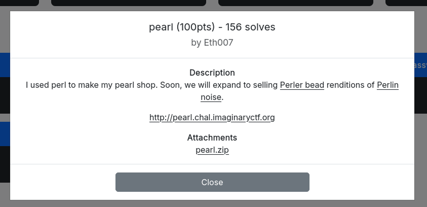

# WhiteDukesDZ - Imaginary CTF 2025 Writeup: pearl



The full source code for the application was provided (see the `challenge` directory), allowing for in-depth analysis and understanding of its functionality and security.

---

## Challenge Summary

This challenge presents a custom web server written in Perl using HTTP::Daemon. The server serves files and directories from a files/ directory, with basic protections against path traversal and command injection. Directory listings are generated dynamically, and files are served as HTML. The Dockerfile reveals that the real flag is renamed to /flag-<md5>.txt at build time, making its name unpredictable. The challenge centers on exploring the web server’s file handling, bypassing path restrictions, and discovering the renamed flag file.

## Application Analysis

The core of the challenge is implemented in `server.pl`, a custom Perl web server using HTTP::Daemon. Here is a detailed breakdown of its logic and security implications:

- **Server Setup:**
  - The server listens on all interfaces at port 8080 and serves files from the `files/` directory.
  - Requests are handled in a loop, accepting connections and processing HTTP GET requests.

- **Request Handling:**
  - The requested path is URL-decoded and sanitized by removing the leading slash. If no path is provided, it defaults to `index.html`.
  - The full file path is constructed using `File::Spec->catfile($webroot, $path)`.
  - The server checks for path traversal (`..`), command injection characters (`,`, `	`, `;`, `&`, `` ` ``, `(`, `)`), and pipe usage. If any are found, it returns a 400 Bad Request.

- **Directory Listing:**
  - If the requested path is a directory, the server lists its contents (excluding dotfiles) as HTML links, allowing navigation through the file tree.

- **File Serving:**
  - If the requested path is a file, the server attempts to open and read it, serving its contents as HTML (regardless of actual MIME type).
  - If the file cannot be opened, a 500 Internal Server Error is returned.

### Security Observations

```pearl
if ($fullpath =~ /\.\.|[,\`\)\(;&]|\|.*\|/) {
    $c->send_error(RC_BAD_REQUEST, "Invalid path");
    next;
}
```

doesn't block new lines `\n` or encoded as `%0A`. The shell may interpret it as a command separator. Also it is blocking `|` only if it is preceded and follow by any character. so `| something |` is blocked but `something |` is not blocked.

---

## Solution

We already know from `challenge/Dockerfile` that the flag is on `/flag<md5>.txt`. And from the above analysis we can cause a command injection to leak the flag. This can be performed using this payload `%0A%20cat%20/flag*.txt|` which will be decoded to `\n cat flag*.txt|`.

The perl `open` function will recieve it as a file name argument `open(my $fh, $fullpath)`. And because it contains `|` at the end, Perl will interpret it as a shell command to execute `cat /flag*.txt`, the output of this command will be sent back in the HTTP response.

We created a python script to automate this process (see `solution/solve.py`).

If successful, this will be the output:

```sh
└─$ python3 solve.py
ictf{uggh_why_do_people_use_perl_1f023b129a22}
```
